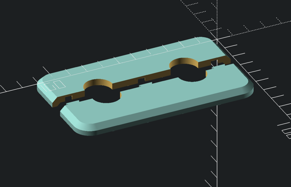

# Pipe cover

Customizable pipe cover



## Building

This project uses [go3mf](https://github.com/philipparndt/go3mf) to build 3MF files from OpenSCAD sources with configuration-driven customization.

### Prerequisites

- OpenSCAD installed and available in your PATH
- `go3mf` tool installed

### Installing go3mf

```bash
brew install philipparndt/go3mf/go3mf
```

### Build the 3MF file

```bash
go3mf combine covers.yaml --open
```

### Configuration

The `covers.yaml` file defines:
- Output filename and build plate settings
- Packing algorithm and spacing between objects
- Multiple object variants with custom parameters
- Each object can have different dimensions and offsets for the pipe holes

See `covers.yaml` for configuration examples.
